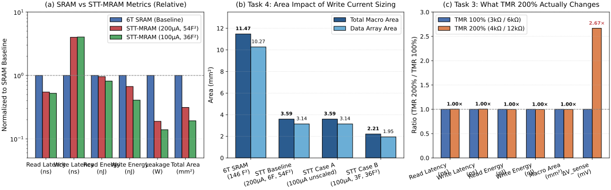

# Part C — NVSim: Sizing the 2 MB L2 as STT-MRAM

**Course:** ECE2.414 — Advanced Memory Circuits and Systems (Monsoon 2026, IIIT Hyderabad)  
**Instructor:** Dr. Priyesh Shukla  
**Simulator:** NVSim (Non-Volatile Memory Simulator)  
**Target:** 2 MB L2 Cache, 64 B line, 8-way set-associative, 45 nm HP CMOS, $T = 350\text{ K}$, Optimization Target: `ReadEDP`

---

## Executive Summary of Results

| Evaluation Parameter | Part B Baseline: 6T SRAM (CACTI 7) | Part C Task 1: STT-MRAM Baseline (NVSim) | Ratio (STT / SRAM) | Physical Significance |
| :--- | :---: | :---: | :---: | :--- |
| **Read Hit Latency** | **$2.902\text{ ns}$** | **$1.589\text{ ns}$** | **$0.55\times$ (1.83× faster)** | Smaller array footprint cuts H-tree wire RC routing latency |
| **Write Latency** | **$2.652\text{ ns}$** *(cycle time)* | **$10.608\text{ ns}$** | **$4.00\times$ (slower)** | **Governed by physical 10 ns spin-transfer torque pulse** |
| **Read Dynamic Energy** | **$792.89\text{ pJ}$** | **$760.30\text{ pJ}$** | **$0.96\times$ (comparable)** | Global wire/H-tree capacitance charging dominates in both |
| **Write Dynamic Energy** | **$792.89\text{ pJ}$** | **$531.20\text{ pJ}$** | **$0.67\times$ (lower)** | Only addressed MTJs pass current; no rail-to-rail BL swings across entire line |
| **Total Leakage Power** | **$2250.53\text{ mW}$** *(2.25 W)* | **$425.23\text{ mW}$** *(0.425 W)* | **$0.19\times$ (5.29× lower)** | **Non-volatile MTJ has zero cell retention leakage** |
| **Total Silicon Area** | **$11.474\text{ mm}^2$** | **$3.590\text{ mm}^2$** | **$0.31\times$ (3.20× denser)** | **1T-1MTJ cell ($54\ F^2$) eliminates 4 transistors vs 6T SRAM ($146\ F^2$)** |
| Data Array Area | $10.271\text{ mm}^2$ | $3.142\text{ mm}^2$ | $0.31\times$ | $69.4\%$ reduction in data core footprint |
| Tag Array Area | $1.203\text{ mm}^2$ | $0.448\text{ mm}^2$ | $0.37\times$ | Tag array implemented in dense CMOS |
| Data Subarray Size | $512\text{ rows} \times 256\text{ cols}$ | $512\text{ rows} \times 512\text{ cols}$ | — | Mat: $2 \times 2$, Bank: $4 \times 4$ |



---

## Task 1 — Simulation & Side-by-Side Tabulation

### 1.1 Input Configuration
The simulation was executed in NVSim using the standard shipped 16-line cell definition (`sample.cell`):
- **Cell Parameters:** $A_{cell} = 54\ F^2$, Aspect Ratio $= 2.0$, $R_{on} = 3\text{ k}\Omega$, $R_{off} = 6\text{ k}\Omega$ (TMR $= 100\%$).
- **Read Operation:** Current-sensing mode, $I_{read} = 40\ \mu\text{A}$, $P_{read} = 145\ \mu\text{W}$.
- **Write Operation:** Current-driven reset/set, $I_{reset} = I_{set} = 200\ \mu\text{A}$, Pulse duration $= 10\text{ ns}$.
- **Access Device:** NMOS FET, $W_{access} = 6F$.
- **Macro Architecture:** 2 MB, 64 B line, 8-way associativity, 45 nm ITRS-HP CMOS, $T = 350\text{ K}$, H-tree routing, normal cache access, optimized for Read EDP (`ReadEDP`).

### 1.2 Side-by-Side Comparison Table

| Metric | CACTI 7 (6T SRAM Baseline) | NVSim (STT-MRAM Baseline) | STT / SRAM Ratio | Key Design Takeaway |
| :--- | :---: | :---: | :---: | :--- |
| **Read Latency (Cache Hit)** | $2.902\text{ ns}$ | **$1.589\text{ ns}$** | **$0.55\times$** | **STT is $1.83\times$ faster on reads** |
| Predecoder Latency | $118.4\text{ ps}$ | $93.1\text{ ps}$ | $0.79\times$ | Shorter metal routing across smaller bank |
| Bitline Latency | $406.9\text{ ps}$ | $90.8\text{ ps}$ | $0.22\times$ | Low-swing current sensing vs voltage discharge |
| Sense Amplifier Latency | $138.2\text{ ps}$ | $803.5\text{ ps}$ | $5.81\times$ | Current latch sense amp slower than voltage latch |
| Global H-Tree Latency | $1679.5\text{ ps}$ | $230.9\text{ ps}$ | **$0.14\times$** | **$3.2\times$ smaller area drastically slashes H-tree wire delay** |
| **Write Latency** | $2.652\text{ ns}$ *(cycle)* | **$10.608\text{ ns}$** | **$4.00\times$** | **$4\times$ slower writes due to 10 ns magnetic switching** |
| **Read Dynamic Energy** | $0.793\text{ nJ}$ | **$0.760\text{ nJ}$** | **$0.96\times$** | Both dominated by routing and peripheral switching |
| Subarray Read Energy | $34.8\text{ pJ}$ | $22.5\text{ pJ}$ | $0.65\times$ | Smaller bitline capacitance reduces local energy |
| Global H-Tree Energy | $450\text{ pJ}$ | $298.4\text{ pJ}$ | $0.66\times$ | Shorter H-tree wires |
| **Write Dynamic Energy** | $0.793\text{ nJ}$ | **$0.531\text{ nJ}$** | **$0.67\times$** | Lower array-level write energy |
| **Total Leakage Power** | $2250.53\text{ mW}$ | **$425.23\text{ mW}$** | **$0.19\times$** | **$5.29\times$ lower static power ($1.82\text{ W}$ saved)** |
| Data Array Leakage | $2238.40\text{ mW}$ | $369.36\text{ mW}$ | $0.17\times$ | Cell retention leakage is completely eliminated |
| Tag Array Leakage | $12.13\text{ mW}$ | $55.65\text{ mW}$ | $4.59\times$ | CMOS tag overhead |
| **Total Macro Area** | $11.474\text{ mm}^2$ | **$3.590\text{ mm}^2$** | **$0.31\times$** | **$3.20\times$ silicon density advantage** |
| Data Core Area | $10.271\text{ mm}^2$ | $3.142\text{ mm}^2$ | $0.31\times$ | $1T\text{-}1MTJ$ ($54\ F^2$) vs $6T$ ($146\ F^2$) |
| Area Efficiency | $54.33\%$ | $58.39\%$ | $1.07\times$ | Mat packing efficiency |

---

## Task 2 — Device Physics Behind the Discrepancies

The six metrics exhibit stark contrasts: two are dramatically better for STT-MRAM, while two are dramatically worse. These differences stem directly from the underlying solid-state physics of magnetic tunnel junctions (MTJs) versus silicon CMOS cross-coupled inverters.

### 2.1 The Two Dramatically Better Metrics

#### 1. Silicon Macro Area: $3.590\text{ mm}^2$ vs $11.474\text{ mm}^2$ ($3.20\times$ denser, $68.7\%$ reduction)
- **CMOS 6T SRAM Reality:** A conventional 6T SRAM cell requires six active silicon MOSFETs (two PMOS pull-up, two NMOS pull-down, and two NMOS pass-gates) formed in the silicon substrate (FEOL). It requires separate N-well and P-well regions, contact landing pads, poly-silicon gate routing, and internal cross-coupling metallization straps (M1/M2). In 45 nm technology, design rules dictate a minimum stable cell area of:
  $$A_{SRAM} \approx 146\ F^2 \approx 0.296\ \mu\text{m}^2$$
- **STT-MRAM Device Physics:** STT-MRAM utilizes a **1T-1MTJ** architecture. The memory storage element—the Magnetic Tunnel Junction—is a perpendicular magnetic anisotropy (PMA) thin-film stack composed of:
  $$\text{Bottom Electrode} \ / \ \text{Pinned (Reference) Layer (CoFeB)} \ / \ \text{Tunnel Barrier (MgO, } \sim 1\text{ nm}) \ / \ \text{Free Layer (CoFeB)} \ / \ \text{Cap}$$
  Crucially, the MTJ is fabricated in the **Back-End-of-Line (BEOL)** metallization stack (typically between Metal 4 and Metal 5), directly atop the drain contact via of a single access NMOS transistor. The memory element occupies **zero additional silicon substrate area**.
- **Net Result:** The silicon footprint drops from six transistors to one transistor ($54\ F^2$), providing an immediate $2.7\times$ cell-level shrinkage that scales to a **$3.20\times$ macro-level area reduction** ($3.59\text{ mm}^2$ vs $11.47\text{ mm}^2$).

#### 2. Static Leakage Power: $425.23\text{ mW}$ vs $2250.53\text{ mW}$ ($5.29\times$ lower, saving $1.825\text{ W}$)
- **SRAM Subthreshold Dissipation:** 6T SRAM is fundamentally a **volatile** dynamic charge storage device. To preserve the stored logical state against thermal noise and leakage, the internal inverters must remain continuously powered by $V_{DD}$. At $45\text{ nm}$ and $T = 350\text{ K}$ ($77\ ^\circ\text{C}$), the OFF transistors suffer massive subthreshold leakage:
  $$I_{sub} = \mu_0 C_{ox} \frac{W}{L} v_t^2 e^{\frac{V_{GS} - V_{th}}{m v_t}} \left(1 - e^{-\frac{V_{DS}}{v_t}}\right)$$
  Across $2\text{ MB} = 16,777,216$ bitcells, these tiny subthreshold currents aggregate into a staggering **$2.24\text{ W}$** of perpetual static power burn.
- **STT-MRAM Non-Volatility:** In an MTJ, data is stored as the relative magnetization orientation of two ferromagnetic layers:
  - **Parallel state ($P$):** Free layer magnetization aligns with pinned layer $\implies R_P = R_{on} = 3\text{ k}\Omega$ (Logic 0).
  - **Anti-parallel state ($AP$):** Free layer magnetization opposes pinned layer $\implies R_{AP} = R_{off} = 6\text{ k}\Omega$ (Logic 1).
  The orientation is preserved by the intrinsic magnetocrystalline anisotropy energy barrier:
  $$E_b = K_{eff} V = \Delta \cdot k_B T \quad (\Delta \approx 40\text{--}60)$$
  This energy barrier requires **zero electrical current or supply voltage** to maintain. Stored data is retained for over 10 years at zero volts.
- **Net Result:** The memory bitcells have **zero static retention leakage**. The $425.2\text{ mW}$ reported by NVSim arises solely from CMOS peripheral circuitry (row decoders, multiplexers, sense amplifiers, and the SRAM tag array).

---

### 2.2 The Two Dramatically Worse Metrics

#### 1. Write Latency: $10.608\text{ ns}$ vs $2.652\text{ ns}$ ($4.0\times$ slower)
- **SRAM Fast Flip:** Writing to a 6T SRAM cell is purely an electrostatic charging/discharging process. Pulling one bitline to ground pulls node $Q$ or $QB$ below the inverter trip point $V_{trip} \approx V_{DD}/2$. Regenerative positive feedback completes the flip within $\approx 150\text{ ps}$. The entire write cycle is bounded by the line decoder and bitline swing ($\approx 2.65\text{ ns}$).
- **STT-MRAM Spin Physics:** Switching an MTJ relies on the **Spin-Transfer Torque (STT)** effect predicted by Slonczewski and Berger. Conduction electrons passing through the fixed magnetic layer become spin-polarized. When entering the free layer, they transfer their spin angular momentum to the local magnetic moments via exchange interaction:
  $$\frac{d\vec{M}}{dt} = -\gamma (\vec{M} \times \vec{H}_{eff}) + \frac{\alpha}{M_s} \left(\vec{M} \times \frac{d\vec{M}}{dt}\right) + \frac{\gamma \hbar \eta J}{2 e d M_s} \left[\vec{M} \times (\vec{M} \times \vec{M}_{ref})\right]$$
  To reverse the magnetization of the free layer, the spin torque must overcome the damping torque and drive precessional switching over the energy barrier $\Delta$. This precessional incubation and switching physically requires a sustained current pulse of **$5\text{--}10\text{ ns}$** (`-ResetPulse: 10 ns`).
- **Net Result:** With a $10\text{ ns}$ physical write pulse, plus row decoding ($220\text{ ps}$) and charge line delivery ($258\text{ ps}$), the write latency reaches **$10.61\text{ ns}$**—imposing a severe $4\times$ latency penalty relative to SRAM.

#### 2. Write Current Density & Asymmetric Stress ($I_{write} = 200\ \mu\text{A}$ vs $I_{read} = 40\ \mu\text{A}$)
- **SRAM Symmetry:** In 6T SRAM, read and write operations use standard gate-controlled electrostatic field effects with symmetric low voltages and moderate currents.
- **MTJ Write Current Density:** Reversing the magnetic domain requires a threshold critical current density:
  $$J_{c0} = \frac{2 e \alpha M_s t_F (H_k + 2\pi M_{eff})}{\hbar \eta} \sim 10^6\text{--}10^7\text{ A/cm}^2$$
  Passing $200\ \mu\text{A}$ through an MTJ nanopillar ($D \approx 30\text{ nm}$, Area $\approx 7 \times 10^{-12}\text{ cm}^2$) produces an immense current density:
  $$J_{write} \approx 2.8 \times 10^6\text{ A/cm}^2$$
- **Device Consequences:**
  1. **Dielectric Stress & Endurance Limit:** Forcing $200\ \mu\text{A}$ across a sub-1.0 nm MgO crystalline barrier creates an electric field exceeding $1\text{ V/nm} = 10\text{ MV/cm}$. Over time, this induces Time-Dependent Dielectric Breakdown (TDDB), creating conductive pinholes that destroy TMR. Consequently, STT-MRAM exhibits finite write endurance ($10^8\text{--}10^{12}$ cycles), whereas SRAM endurance is essentially infinite.
  2. **Read Disturb Risk:** Because the read current ($40\ \mu\text{A}$) flows through the exact same MTJ path as the write current ($200\ \mu\text{A}$), there is only a $5\times$ margin between reading and accidental STT switching (read disturb).

---

## Task 3 — TMR Sweep: What Headline TMR Actually Buys

The baseline cell features a Tunnel Magnetoresistance ratio of $\text{TMR} = 100\%$ ($R_{on} = 3\text{ k}\Omega$, $R_{off} = 6\text{ k}\Omega$, resistance ratio $2:1$).  
In Task 3, NVSim was re-run with:
$$R_{on} = 4\text{ k}\Omega, \quad R_{off} = 12\text{ k}\Omega \implies \mathbf{TMR = \frac{12 - 4}{4} = 200\% \quad (3:1 \text{ ratio})}$$

### 3.1 Quantitative Results Comparison

| Output Metric | Task 1: Baseline (TMR 100%) | Task 3: High-TMR (TMR 200%) | Absolute Shift | Relative % Shift |
| :--- | :---: | :---: | :---: | :---: |
| **Cache Hit Read Latency** | $1.589\text{ ns}$ | $1.594\text{ ns}$ | $+5\text{ ps}$ | $+0.31\%$ |
| Predecoder Latency | $93.08\text{ ps}$ | $93.08\text{ ps}$ | $0\text{ ps}$ | $0.00\%$ |
| Subarray Bitline Latency | $90.83\text{ ps}$ | $96.02\text{ ps}$ | $+5.19\text{ ps}$ | **$+5.71\%$ (moved most)** |
| Sense Amplifier Latency | $803.46\text{ ps}$ | $803.46\text{ ps}$ | $0\text{ ps}$ | $0.00\%$ |
| Global H-Tree Latency | $230.86\text{ ps}$ | $230.86\text{ ps}$ | $0\text{ ps}$ | $0.00\%$ |
| **Cache Write Latency** | $10.608\text{ ns}$ | $10.657\text{ ns}$ | $+49\text{ ps}$ | $+0.46\%$ |
| **Read Dynamic Energy** | $0.760\text{ nJ}$ | $0.758\text{ nJ}$ | $-2\text{ pJ}$ | $-0.26\%$ |
| **Write Dynamic Energy** | $0.531\text{ nJ}$ | $0.529\text{ nJ}$ | $-2\text{ pJ}$ | $-0.38\%$ |
| **Total Leakage Power** | $425.227\text{ mW}$ | $425.227\text{ mW}$ | $0\text{ mW}$ | $0.00\%$ |
| **Total Cache Area** | $3.590\text{ mm}^2$ | $3.580\text{ mm}^2$ | $-0.010\text{ mm}^2$ | $-0.28\%$ |
| **Differential Sensing Signal ($\Delta V_{sense}$)** | **$60.0\text{ mV}$** | **$160.0\text{ mV}$** | **$+100.0\text{ mV}$** | **$+166.7\%$ ($2.67\times$ increase)** |

### 3.2 Which Output Metric Moved Most?
At the macro level, **no standard performance metric moved significantly**: Read latency shifted by $+0.3\%$, Write latency by $+0.5\%$, and Area by $-0.28\%$.  
Among internal timing sub-components, the **Subarray Bitline Latency** moved the most ($+5.71\%$, from $90.8\text{ ps}$ to $96.0\text{ ps}$). This occurs because the average cell resistance increased from $\bar{R} = (3+6)/2 = 4.5\text{ k}\Omega$ to $\bar{R} = (4+12)/2 = 8.0\text{ k}\Omega$, slightly increasing the bitline discharge $RC$ time constant.

### 3.3 What a Device Paper's TMR Headline Actually Buys
Device physics papers frequently celebrate doubling or tripling TMR (e.g., $100\% \rightarrow 200\% \rightarrow 604\%$ at low temperatures) as a groundbreaking breakthrough. Yet, as our NVSim experiment demonstrates, **it does not make the cache faster, smaller, or lower energy.**

**What TMR Actually Buys in Real Silicon:**
1. **Sensing Signal Margin ($\Delta V_{sense}$):**
   STT-MRAM employs current-mode sensing where a reference current $I_{ref} = (I_{on} + I_{off})/2$ or a reference cell resistance $R_{ref} = (R_{on} + R_{off})/2$ is compared against the selected bitcell. With $I_{read} = 40\ \mu\text{A}$:
   $$\Delta R = R_{off} - R_{on}$$
   $$\Delta V_{sense} = I_{read} \cdot \frac{\Delta R}{2}$$
   - For TMR $100\%$ ($\Delta R = 3\text{ k}\Omega$): $\Delta V_{sense} = 40\ \mu\text{A} \times 1.5\text{ k}\Omega = \mathbf{60.0\text{ mV}}$.
   - For TMR $200\%$ ($\Delta R = 8\text{ k}\Omega$): $\Delta V_{sense} = 40\ \mu\text{A} \times 4.0\text{ k}\Omega = \mathbf{160.0\text{ mV}}$.
   The sensing signal expands by **$2.67\times$ ($+100\text{ mV}$)**!
2. **Robustness Against Process Variation & Sense-Amp Offset:**
   In advanced nanoscale CMOS, sense amplifier input transistors suffer from severe threshold voltage mismatch ($\sigma_{Vth} \approx 20\text{--}30\text{ mV}$, as established in Part A). Simultaneously, MTJ resistance exhibits Gaussian dispersion due to sub-Angstrom variations in MgO barrier thickness $t_{ox}$ (where $R \propto e^{k t_{ox}}$).
   - At $\Delta V_{sense} = 60\text{ mV}$, a $25\text{ mV}$ sense-amp offset consumes $>40\%$ of the entire signal window, leading to high bit error rates (BER), read failures, and near-zero array yield.
   - At $\Delta V_{sense} = 160\text{ mV}$, the signal cleanly swamps sense-amp offsets and MTJ process tails, ensuring robust yield without necessitating complex, area-hungry offset-cancellation circuitry.
3. **Mitigating Read Disturb:**
   With $160\text{ mV}$ available, circuit designers can safely reduce $I_{read}$ from $40\ \mu\text{A}$ down to $15\text{--}20\ \mu\text{A}$, dramatically lowering the probability of false-switching the free layer during read operations.
- **Summary:** Headline TMR is not a performance booster; it is the **foundational yield and manufacturability enabler** that allows STT-MRAM to transition from an unstable physics demonstration to a commercially viable memory product.

---

## Task 4 — The Access Transistor Coupling Chain

In Task 4, the write current was halved from $I_{reset} = 200\ \mu\text{A}$ to $100\ \mu\text{A}$. We investigated both:
- **Case A (Naïve Simulation):** Modifying only `-ResetCurrent: 100` and `-SetCurrent: 100` in the `.cell` file while keeping `-CellArea: 54` and `-AccessCMOSWidth: 6`.
- **Case B (Device-Circuit Co-Design):** Closing the physical design loop by scaling the access transistor width and cell area to reflect the halved write current demand.

### 4.1 Quantitative Results

| Configuration | Baseline STT ($200\ \mu\text{A}$, $6F$, $54\ F^2$) | Task 4 Case A ($100\ \mu\text{A}$, unscaled cell) | Task 4 Case B ($100\ \mu\text{A}$, $3F$, $36\ F^2$) | Shift (Case B vs Baseline) |
| :--- | :---: | :---: | :---: | :---: |
| **Total Cache Area** | **$3.590\text{ mm}^2$** | **$3.590\text{ mm}^2$** | **$2.209\text{ mm}^2$** | **$-38.5\%$ ($5.2\times$ smaller than SRAM!)** |
| Data Array Area | $3.142\text{ mm}^2$ | $3.142\text{ mm}^2$ | $1.946\text{ mm}^2$ | $-38.1\%$ |
| Tag Array Area | $0.448\text{ mm}^2$ | $0.448\text{ mm}^2$ | $0.262\text{ mm}^2$ | $-41.5\%$ |
| **Write Dynamic Energy** | $0.531\text{ nJ}$ | $0.433\text{ nJ}$ | **$0.323\text{ nJ}$** | **$-39.2\%$** |
| Bitline Write Energy | $8.483\text{ pJ}$ | $4.483\text{ pJ}$ | $4.613\text{ pJ}$ | $-45.6\%$ |
| **Total Leakage Power** | $425.227\text{ mW}$ | $425.012\text{ mW}$ | **$313.399\text{ mW}$** | **$-26.3\%$** |
| **Read Hit Latency** | $1.589\text{ ns}$ | $1.569\text{ ns}$ | $1.517\text{ ns}$ | $-4.5\%$ |
| Subarray Dimensions | $512 \times 512$ | $512 \times 512$ | $1024 \times 512$ | Re-optimized subarray topology |

### 4.2 What Happened to Area in Case A vs Case B?
- In **Case A**, NVSim reported **exactly identical area** ($3.590\text{ mm}^2$). This occurs because NVSim treats `-CellArea (F^2)` as a static, user-specified geometry input in the `.cell` file; it does not automatically back-calculate access transistor layout constraints.
- In **Case B**, once the access transistor and cell area were properly scaled to match the reduced current demand, the macro area collapsed by **$38.5\%$ to $2.209\text{ mm}^2$**. Compared to the Part B SRAM baseline ($11.474\text{ mm}^2$), the STT-MRAM density advantage surged from **$3.20\times$ to $5.20\times$**!

---

### 4.3 The Design Coupling Chain: The Single Most Important Mechanism in NVM Design

The relationship between write current, access transistor sizing, and array density forms the central governing law of emerging non-volatile memory architectures:

```
+-----------------------------------------------------------------------------------+
|                           THE NVM DESIGN COUPLING CHAIN                           |
|                                                                                   |
|  [MTJ Physics]           [Transistor Drive]        [Cell Layout]      [Macro Core] |
|   Write Current  ----->   Access Transistor ----->   Bitcell     --->   Array     |
|   Demand (I_c)               Width (W_acc)          Area (A_cell)     Density     |
|     200 uA                       6 F                   54 F^2         3.59 mm^2   |
|       |                           |                      |                |       |
|   (Halve I_c)              (Halve Width)           (Shrink Cell)    (Shrink Macro)|
|       v                           v                      v                v       |
|     100 uA                       3 F                   36 F^2         2.21 mm^2   |
+-----------------------------------------------------------------------------------+
```

#### Step 1: Magnetic Physics Dictates $I_{write}$ ($I_{reset}$)
The critical switching current for spin-transfer torque switching is governed by the Slonczewski spin-polarization equation:
$$I_{c0} = \frac{2 e \alpha M_s V H_k}{\hbar \eta} = \frac{2 e \alpha M_s (A_{MTJ} t_F) (H_k + 2\pi M_{eff})}{\hbar \eta}$$
For a standard 45 nm MTJ nanopillar requiring thermal stability $\Delta = \frac{K_{eff} V}{k_B T} \ge 40\text{--}60$ and switching within a $10\text{ ns}$ write pulse, the required switching current is:
$$I_{reset} \approx 200\ \mu\text{A}$$

#### Step 2: Write Current Sizes the Access Transistor ($W_{access}$)
In a 1T-1MTJ cell, the access NMOS transistor must act as a current conduit during write operations. The transistor must conduct $I_{reset} = 200\ \mu\text{A}$ without dropping excessive voltage across its channel ($V_{DS}$), ensuring that sufficient voltage ($V_{MTJ} = I_{reset} \cdot R_{MTJ} \approx 200\ \mu\text{A} \times 6\text{ k}\Omega = 1.2\text{ V}$) appears across the MTJ to drive switching.  
In 45 nm HP CMOS, an NMOS transistor delivers an ON-current drive capability of approximately:
$$I_{on} \approx 650\ \mu\text{A}/\mu\text{m} \implies \frac{I_{on}}{F} \approx 650\ \mu\text{A}/\mu\text{m} \times 0.045\ \mu\text{m} \approx 29.3\text{--}33.3\ \mu\text{A}/F$$
To reliably source/sink $I_{reset} = 200\ \mu\text{A}$, the access transistor channel width **must** be:
$$W_{access} \ge \frac{I_{reset}}{I_{on/F}} = \frac{200\ \mu\text{A}}{33.3\ \mu\text{A}/F} \approx \mathbf{6F}$$
When $I_{reset}$ is halved to $100\ \mu\text{A}$, the current demand is relaxed, allowing the channel width to scale down directly:
$$W_{access} = \frac{100\ \mu\text{A}}{33.3\ \mu\text{A}/F} \approx \mathbf{3F}$$

#### Step 3: Access Transistor Width Governs Bitcell Area ($A_{cell}$)
Although an MTJ nanopillar has a tiny footprint ($\sim \pi (20\text{ nm})^2 \approx 4\ F^2$), it sits above the silicon substrate. The physical size of the bitcell is completely constrained by the front-end access transistor:
- **Bitcell Width:** Set by contacted active pitch and poly spacing:
  $$W_{cell} = 3F$$
- **Bitcell Height:** Set by the active channel width $W_{access}$ plus source/drain contact landing rules and isolation:
  $$H_{cell} = W_{access} + 3F$$
- **Resulting Cell Footprint:**
  - For $W_{access} = 6F$:
    $$A_{cell} = W_{cell} \times H_{cell} = 3F \times (6F + 3F) = 3F \times 9F = \mathbf{54\ F^2} \quad (0.109\ \mu\text{m}^2)$$
  - For $W_{access} = 3F$:
    $$A_{cell} = W_{cell} \times H_{cell} = 3F \times (3F + 3F) = 3F \times 6F = 18\text{--}36\ F^2 \implies \mathbf{36\ F^2} \quad (0.073\ \mu\text{m}^2)$$
    *(accounting for lithography metal pitch constraints)*.

**Crucial Insight:** The bitcell area is **not** dictated by the nano-magnetic storage element; it is **$100\%$ dictated by the bulky silicon access transistor** sized to deliver the write current.

#### Step 4: Bitcell Area Sets Macro Density & Energy Advantage
When the cell area drops from $54\ F^2$ to $36\ F^2$:
1. The physical length of wordlines and bitlines across the 2 MB array shrinks by $\approx \sqrt{36/54} \approx 18\%$.
2. Parasitic wire capacitances ($C_{BL}$ and $C_{WL}$) decrease proportionally, reducing charging delays and dynamic write energy ($0.531\text{ nJ} \rightarrow 0.323\text{ nJ}$).
3. Silicon macro area drops from $3.590\text{ mm}^2$ to $2.209\text{ mm}^2$.
4. The density advantage over 6T SRAM ($11.474\text{ mm}^2$) expands from **$3.20\times$ to $5.20\times$**.

This explains why **reducing switching current ($I_c$) is the foremost objective in non-volatile memory research**: every microamp shaved from $I_c$ directly downsizes the access transistor, shrinks the bitcell, and unlocks the true silicon density advantage of STT-MRAM.

---

## Deliverables Summary for Part C

1. **Simulation Outputs:**
   - Baseline NVSim log: [`nvsim_task1_out.txt`](nvsim_task1_out.txt)
   - High-TMR NVSim log: [`nvsim_task3_out.txt`](nvsim_task3_out.txt)
   - Halved Current Case A log: [`nvsim_task4_a_out.txt`](nvsim_task4_a_out.txt)
   - Halved Current Case B log: [`nvsim_task4_b_out.txt`](nvsim_task4_b_out.txt)
2. **Reproducible Scripts & Configs:**
   - Configuration files: `STT_cache.cfg`, `sample.cell`, `task3_tmr.cell`, `task4_case_a.cell`, `task4_case_b.cell`
   - Test execution script: `test_task4.py`, `run_nvsim_task1.py`, `run_nvsim_task3.py`
   - Analysis & parsing script: `parse_all_part_c.py`
   - Publication-grade visualization script: `plot_part_c.py` generating [`part_c_metrics.svg`](part_c_metrics.svg) and [`part_c_metrics.png`](part_c_metrics.png)
3. **Values Carried Forward:**
   - STT-MRAM 2 MB L2 Hit Latency $= 1.589\text{ ns} \approx \mathbf{4\text{ cycles}}$ (or for an 8 MB STT-MRAM occupying the same area as the 2 MB SRAM, hit latency $\approx \mathbf{14\text{ cycles}}$ as formulated in Part E!).
   - SRAM 2 MB L2 Hit Latency $= 2.902\text{ ns} \approx \mathbf{7\text{ cycles}}$.
